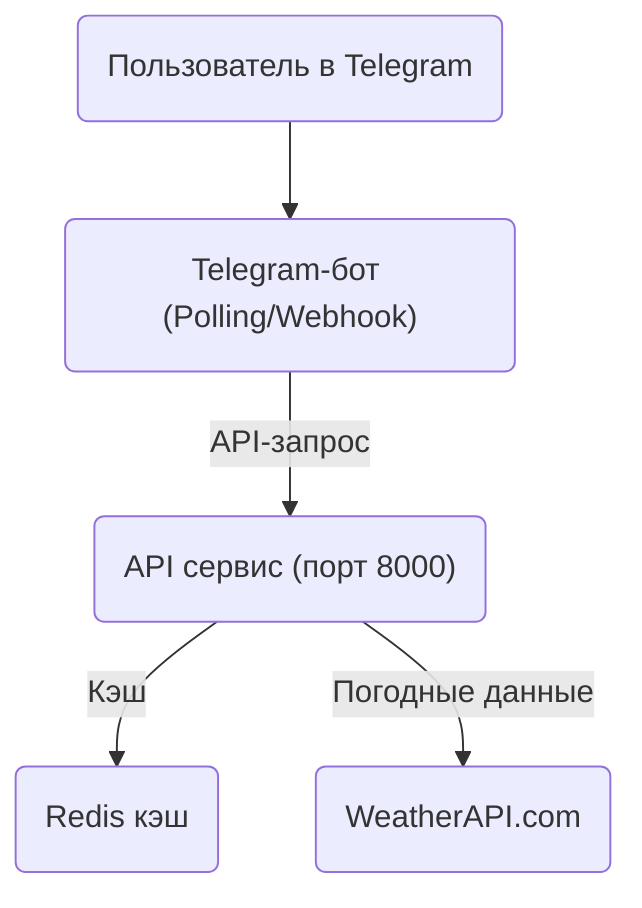

# Weather API Service 🌤️



## Структура проекта

```
weather-api-service/
├── bot/                    # Модуль Telegram-бота (порт 8001)
│   ├── api.py             # Клиент для обращения к API сервису
│   ├── bot.py             # Основной файл бота + FastAPI webhook сервер
│   ├── handlers.py        # Обработчики сообщений и команд
│   ├── keyboards.py       # Клавиатуры и кнопки
│   ├── middlewares.py     # Промежуточные обработчики (антиспам)
│   └── states.py          # Состояния FSM
├── tests/                  # Модульные и интеграционные тесты
│   ├── conftest.py        # Фикстуры для тестов
│   ├── test_api.py        # Тесты API endpoints
│   ├── test_weather_image.py  # Тесты генерации изображений
│   └── test_cache.py      # Тесты кэширования Redis
├── fonts/                  # Шрифты для генерации изображений
│   └── DejaVuSans.ttf     # Основной шрифт
├── logs/                   # Логи приложения
├── data/                   # Данные (база данных пользователей)
├── main.py                # Основной файл FastAPI приложения (порт 8000)
├── cache.py               # Модуль кэширования Redis
├── weather_image.py       # Генерация изображений с погодой
├── requirements.txt       # Зависимости Python
├── requirements-test.txt  # Зависимости для тестирования
├── Dockerfile            # Конфигурация Docker для API
├── Dockerfile.bot        # Конфигурация Docker для бота
├── docker-compose.yml    # Конфигурация Docker Compose
└── env.example           # Пример переменных окружения
```

## О проекте

**Weather API Service** — это универсальный погодный backend с Telegram-ботом, который:
- Предоставляет REST API для получения текущей погоды, прогноза и поиска городов
- Включает Telegram-бота с webhook архитектурой для быстрого отклика
- Реализует Redis-кэширование для оптимизации производительности
- Генерирует красивые изображения с погодой для Telegram
- Поддерживает автоматический деплой через GitHub Actions

## Архитектура

### Контейнеры
- **API контейнер (порт 8000)** - FastAPI сервер для погодных данных
- **Bot контейнер (порт 8001)** - Telegram-бот (Polling/Webhook)
- **Redis контейнер (порт 6379)** - Кэширование данных

### Webhook архитектура
- Бот может работать через webhook для быстрого отклика
- Автоматическая настройка webhook при запуске

## Основные возможности

### API сервис (порт 8000)
- **Асинхронный FastAPI** — высокая производительность и масштабируемость
- **Pydantic** — строгая типизация и валидация данных
- **Swagger/OpenAPI** — автогенерация документации
- **Redis-кэширование** — ускоряет ответы и экономит лимиты внешнего API
- **Генерация изображений** — создание красивых карточек с погодой

### Telegram-бот (порт 8001)
- **Webhook архитектура** — быстрый отклик на сообщения
- **Антиспам middleware** — защита от флуда
- **FSM (Finite State Machine)** — управление состояниями диалога
- **Интерактивные клавиатуры** — удобный выбор городов
- **Интеграция с API** — получение погоды и изображений

### Кэширование
- **Redis** — быстрое кэширование данных
- **Настраиваемые TTL** — гибкое управление временем жизни кэша
- **Мониторинг** — эндпоинты для проверки состояния кэша
- **Очистка** — возможность очистки кэша по типам

---

## Кэширование с помощью Redis

Сервис поддерживает автоматическое кэширование данных о погоде, прогнозах и поиске городов с помощью Redis. Это позволяет:
- Ускорить ответы для популярных городов
- Снизить количество обращений к внешнему WeatherAPI
- Гибко настраивать время жизни кэша (TTL)

### Как это работает
- При запросе погоды или прогноза сервис сначала ищет данные в Redis.
- Если данные есть и не устарели — возвращает их мгновенно.
- Если данных нет или TTL истёк — делает запрос к WeatherAPI, сохраняет результат в кэш и возвращает пользователю.

### Настройка
- Redis поднимается автоматически через docker-compose (сервис `redis`).
- Все параметры кэширования настраиваются через переменные окружения:

```
REDIS_URL=redis://localhost:6379         # URL подключения к Redis
CACHE_TTL_WEATHER=600                    # TTL для текущей погоды (секунды, по умолчанию 10 минут)
CACHE_TTL_FORECAST=1800                  # TTL для прогноза (секунды, по умолчанию 30 минут)
CACHE_TTL_CITIES=3600                    # TTL для поиска городов (секунды, по умолчанию 1 час)
```

### Эндпоинты для мониторинга и управления кэшем

- `GET /cache/stats` — статистика кэша (количество ключей, использование памяти и т.д.)
- `GET /cache/health` — проверка состояния кэша
- `DELETE /cache/clear` — очистка всего кэша или по типу/ключу (например, `/cache/clear?cache_type=weather&identifier=Moscow`)

---

## Установка и запуск

### Предварительные требования
- Python 3.8 или выше
- Git
- Редактор кода (VS Code, PyCharm и т.д.)
- Терминал (Terminal для macOS, Command Prompt или PowerShell для Windows)

### Установка для macOS/Linux

1. **Клонирование репозитория:**
```bash
# Создайте папку для проекта
mkdir ~/Projects
cd ~/Projects

# Клонируйте репозиторий
git clone https://github.com/your-username/weather-api-service.git
cd weather-api-service
```

2. **Создание и активация виртуального окружения:**
```bash
# Создание виртуального окружения
python3 -m venv venv

# Активация виртуального окружения
source venv/bin/activate
```

3. **Установка зависимостей:**
```bash
# Обновление pip
pip install --upgrade pip

# Установка зависимостей
pip install -r requirements.txt

# Установка зависимостей для тестов (опционально)
pip install -r requirements-test.txt
```

4. **Настройка переменных окружения:**
```bash
# Копирование примера конфигурации
cp env.example .env

# Откройте файл .env в редакторе и добавьте:
# - WEATHER_API_KEY (получить на weatherapi.com)
# - TELEGRAM_BOT_TOKEN (получить у @BotFather)
```

### Установка для Windows

1. **Клонирование репозитория:**
```powershell
# Создайте папку для проекта
mkdir C:\Projects
cd C:\Projects

# Клонируйте репозиторий
git clone https://github.com/your-username/weather-api-service.git
cd weather-api-service
```

2. **Создание и активация виртуального окружения:**
```powershell
# Создание виртуального окружения
python -m venv venv

# Активация виртуального окружения
.\venv\Scripts\activate
```

3. **Установка зависимостей:**
```powershell
# Обновление pip
python -m pip install --upgrade pip

# Установка зависимостей
pip install -r requirements.txt

# Установка зависимостей для тестов (опционально)
pip install -r requirements-test.txt
```

4. **Настройка переменных окружения:**
```powershell
# Копирование примера конфигурации
copy env.example .env

# Откройте файл .env в редакторе и добавьте:
# - WEATHER_API_KEY (получить на weatherapi.com)
# - TELEGRAM_BOT_TOKEN (получить у @BotFather)
```

### Запуск приложения

1. **Запуск API сервиса:**
```bash
# Стандартный запуск
python main.py

# Или через uvicorn с автоперезагрузкой (для разработки)
uvicorn main:app --reload --host 0.0.0.0 --port 8000
```

2. **Запуск Telegram бота:**
```bash
# В отдельном терминале
python -m bot.bot
```

3. **Запуск через Docker:**
```bash
# Сборка и запуск всех сервисов
docker-compose up --build

# Запуск в фоновом режиме
docker-compose up -d
```

### Запуск тестов

```bash
# Запуск всех тестов
pytest tests/

# Запуск с отчетом о покрытии
pytest tests/ --cov=.

# Запуск тестов в Docker
docker-compose exec api pytest tests/
```

## API документация

После запуска API сервиса документация доступна по адресам:
- Swagger UI: http://localhost:8000/docs
- ReDoc: http://localhost:8000/redoc

## Основные эндпоинты

### Погода
- `POST /weather` - получение погоды по пользователю
- `POST /weather/by_city` - получение погоды по городу
- `GET /weather/current/{city}` - текущая погода (GET)
- `GET /weather/forecast/{city}` - прогноз погоды (GET)

### Поиск городов
- `POST /cities/search` - поиск городов
- `POST /city/search` - поиск с пагинацией

### Изображения
- `POST /weather/image` - генерация изображения погоды
- `POST /weather/image_by_city` - изображение по городу

### Кэш
- `GET /cache/stats` - статистика кэша
- `GET /cache/health` - состояние кэша
- `DELETE /cache/clear` - очистка кэша

### Webhook (бот)
- `POST /webhook` - обработка webhook от Telegram
- `GET /webhook` - информация о webhook

## Переменные окружения

```bash
curl -X POST "http://localhost:8000/weather" \
     -H "Content-Type: application/json" \
     -d '{"city": "Moscow"}'
```

## CI/CD

Проект настроен для автоматического деплоя:
- **GitHub Actions** - автоматическая сборка и пуш образов в Docker Hub
- **Docker Hub** - хранение образов
- **VPS** - автоматический пул и перезапуск контейнеров

## Мониторинг

- **Логи контейнеров:** `docker-compose logs -f [service]`
- **Статус сервисов:** `docker-compose ps`
- **Использование ресурсов:** `docker stats`
- **Кэш Redis:** `GET /cache/stats`

## Разработка

### Структура кода
- **main.py** - API сервер (порт 8000)
- **bot/bot.py** - бот + webhook сервер (порт 8001)
- **cache.py** - модуль кэширования
- **weather_image.py** - генерация изображений


