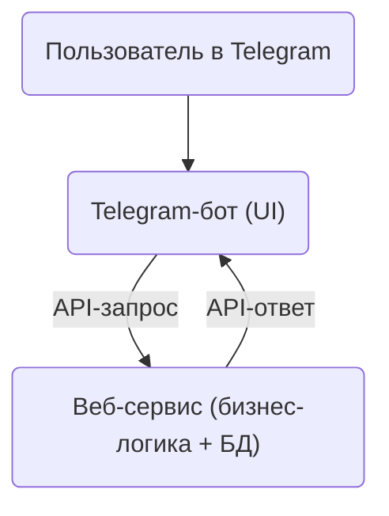

# Weather API Service 🌤️



Современный асинхронный веб-сервис на FastAPI для получения и обработки погодных данных.
Все бизнес-правила и хранение данных реализованы на сервере, а клиенты (бот, веб, мобильные приложения) работают только через API.

---

## Архитектура


---

## О проекте

**Weather API Service** — это универсальный погодный backend, который:
- предоставляет REST API для получения текущей погоды, прогноза и поиска городов,
- легко интегрируется с любыми клиентами: Telegram-бот, мобильное приложение, веб-интерфейс,
- реализует все бизнес-правила и хранение данных на сервере.

**Зачем так?**
- Клиенты становятся максимально простыми и быстрыми.
- Любые изменения логики, интеграций и аналитики делаются только на сервере.
- Масштабирование и поддержка — проще, чем у монолитных ботов.

---

## Как пользоваться

1. **Создайте и активируйте виртуальное окружение:**
```bash
   python3 -m venv venv
   source venv/bin/activate
```

2. **Установите зависимости:**
```bash
pip install -r requirements.txt
```

3. **Настройте переменные окружения (см. `env.example`):**
```bash
cp env.example .env
# Отредактируйте .env файл, добавив ваш WEATHER_API_KEY
```

4. **Запустите сервер:**
```bash
python main.py
   # или
   uvicorn main:app --reload
   ```

5. **Интерактивная документация**  
   После запуска доступна по адресу:  
   - Swagger UI: http://localhost:8000/docs  
   - ReDoc: http://localhost:8000/redoc

6. **Примеры запросов**
   - Получить погоду:
     ```bash
     curl -X POST "http://localhost:8000/weather" -H "Content-Type: application/json" -d '{"city": "Москва"}'
     ```
   - Поиск города:
     ```bash
     curl -X POST "http://localhost:8000/cities/search" -H "Content-Type: application/json" -d '{"query": "Москва"}'
     ```

---

## Основные фичи

- **Асинхронный FastAPI** — высокая производительность и масштабируемость.
- **Pydantic** — строгая типизация и валидация данных.
- **Swagger/OpenAPI** — автогенерация документации.
- **Docker-ready** — легко разворачивается в контейнере.
- **Гибкая архитектура** — легко подключать новых клиентов и расширять API.
- **Логирование и мониторинг** — health-check, логи, обработка ошибок.

---

## Принципы работы

- Все клиенты (бот, веб, мобильное) работают только через HTTP API.
- Сервер сам обращается к внешнему погодному сервису (WeatherAPI.com), хранит пользовательские настройки, кеширует данные.
- Любая бизнес-логика (например, выбор города, форматирование ответа, антиспам) реализуется на сервере.
- Клиенты максимально "тонкие": только UI и отправка запросов.

---

## Где используется такая архитектура?

- Telegram-боты, которые должны быть быстрыми и легко обновляться.
- Мобильные приложения, где важна единая логика для всех платформ.
- Веб-интерфейсы, которые используют тот же API, что и боты.
- Внутренние сервисы и интеграции (например, корпоративные панели, виджеты).

---

## Почему это интересно?

- **Масштабируемость:** можно подключать сколько угодно клиентов без дублирования логики.
- **Гибкость:** любые изменения делаются только на сервере, клиенты не требуют обновления.
- **Безопасность:** все ключи и интеграции хранятся только на сервере.
- **Удобство поддержки:** тесты, логирование, мониторинг — всё централизовано.

---

## Быстрый старт

1. Клонируйте репозиторий и установите зависимости.
2. Настройте .env файл с ключом от WeatherAPI.
3. Запустите сервер.
4. Используйте API с любого клиента — Telegram-бот, Postman, curl, мобильное приложение.

---

## Контейнеризация

Для быстрого деплоя используйте Docker:

```bash
cp env.example .env
docker-compose up --build
```

---

## Структура проекта

```
weather-api-service/
├── main.py              # Основной файл приложения
├── requirements.txt     # Зависимости Python
├── Dockerfile           # Docker конфигурация
├── docker-compose.yml   # Docker Compose конфигурация
├── README.md            # Документация
├── env.example          # Пример переменных окружения
└── logs/                # Папка для логов
  ```

---

## Авторы и поддержка

- Проект создан для демонстрации современной архитектуры веб-сервисов.
- Вопросы и предложения — в Issues или Pull Requests.
